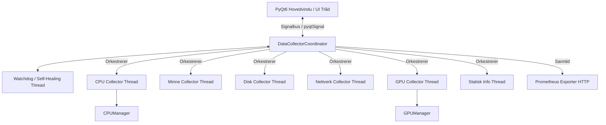

# Teknisk Dokumentasjon: SystemMonitor

Dette dokumentet gir en detaljert teknisk beskrivelse av arkitekturen, komponentene og funksjonene i overvåkingsverktøyet **SystemMonitor**.

---

## 1. Prosjektbeskrivelse & Kjernefilosofi

**SystemMonitor** er en profesjonell, enterprise-grade maskinvare- og ytelsesovervåkingsapplikasjon utviklet i Python og bygget på det robuste grafiske rammeverket **PyQt6**. Systemet er spesielt designet for IT-teknikere, systemadministratorer og utviklere som krever nøyaktig, høyoppløselig sanntidsdata uten at selve overvåkingsverktøyet belaster systemressursene.

### Hovedprinsipper:
*   **Ressurseffektivitet**: Asynkron, trådbasert datainnsamling sikrer minimal CPU-overhead, slik at overvåkingen ikke påvirker ytelsen som måles.
*   **Datapresisjon**: Direkte integrasjon med lavnivå-API-er for å hente rå maskinvaremålinger (klokkefrekvenser, spenninger, viftehastigheter og temperaturer).
*   **Brukeropplevelse (UX)**: Et avansert, adaptivt grensesnitt med glassmorfisme-estetikk, dynamisk temastyring og full DPI-skalering for 1080p til 5K-skjermer.

---

## 2. Arkitektur og Hovedkomponenter

SystemMonitor er modulært oppbygd for å sikre maksimal utvidbarhet og feiltoleranse.

### A. Det Trådbaserte Innsamlingssystemet (Backend Engine)
For å unngå at brukergrensesnittet låser seg (såkalt *UI lag*), kjører alle datainnsamlingsoppgaver i egne bakgrunnstråder (`QThread`):
*   **Asynkron Signalering**: Data pakkes i ordbøker (`dicts`) og sendes via PyQt-signaler (`pyqtSignal(dict)`). Det benyttes dypkopiering (`.copy()`) for å forhindre delte referanser og unngå *race conditions* mellom trådene.
*   **Debouncing & Throttling**: Datakoordinatoren samler inn data fra trådene og benytter en 50ms timer for å sende oppdateringer til grensesnittet i kontrollerte pakker. Dette forhindrer at raske svingninger overbelaster UI-tegningen.
*   **Watchdog (Self-Healing)**: En overvåkingsmekanisme sjekker regelmessig helsen til samler-trådene. Hvis en tråd skulle krasje som følge av en midlertidig driverfeil eller rettighetsprogram, restarter koordinatoren tråden automatisk i bakgrunnen uten avbrudd for brukeren.

### B. Hardware-abstraksjonslaget (HAL)
SystemMonitor kommuniserer med maskinvaren gjennom spesialiserte managere:
*   **CPUManager (Hybrid og Fallback)**:
    *   *Kjerne-topologi*: Identifiserer automatisk Intels hybrid-arkitektur (P-cores og E-cores) for 12. generasjon prosessorer og nyere, ved å beregne forholdet mellom logiske tråder og fysiske kjerner:
        $$\text{P-kjerner} = \text{Logiske kjerner} - \text{Fysiske kjerner}$$
        $$\text{E-kjerner} = \text{Fysiske kjerner} - \text{P-kjerner}$$
    *   *Temperaturfallback*: Bruker en prioritert fallback-kjede: Først direkte via operativsystemets kernel (`psutil`), deretter via WMI-spørringer (ACPI Thermal Zone), og til slutt via lavnivå-avlesing av HWiNFOs delte minnesegment (`Shared Memory`) ved hjelp av `ctypes` (Win32 API).
*   **GPUManager (Multi-GPU-støtte)**:
    *   Håndterer flere skjermkort samtidig.
    *   Støtter proprietære backends som NVIDIA NVML (Nvidia Management Library) og AMD ADL2 (AMD Display Library).
    *   Faller tilbake til WMI og OpenCL for VRAM-deteksjon dersom driver-API-er er utilgjengelige.

---

## 3. Funksjonelle Moduler

### 📊 CPU- og Ytelsesanalyse
*   Sanntidsvisning av total belastning og belastning per kjerne.
*   Overvåking av prosessorklokke (gjeldende, maksimum og minimum).
*   Detaljert måling av systemavbrudd (Interrupts / IRQs) og kontekstbytter (Context Switches).

### 🧠 Minnehåndtering (RAM & SWAP)
*   Visning av fysisk minnebruk (totalt, brukt, tilgjengelig, buffer/cache).
*   Automatisk deteksjon av RAM-type (f.eks. DDR4/DDR5) og hastigheter.
*   Sanntidsovervåking av sidevekslingsfilen (SWAP-minne).

### 💾 Lagring & Diskovervåking
*   Partisjonsoversikt med mountpoints, filsystemer og gjenværende kapasitet.
*   I/O-hastigheter (lese- og skrivehastighet i sanntid) per fysiske disk.
*   SMART-helsedata (helsetilstand, temperatur, slitasjeindikatorer og feil-logger) for SSD og HDD.

### 🌐 Nettverksovervåking
*   Måling av opp- og nedlastingshastighet med eksponentiell glatting (EMA) for å gi realistiske, stabile grafer.
*   Automatisk identifisering av den aktive fysiske nettverkstilkoblingen (WiFi vs. Ethernet).
*   Oversikt over aktive nettverkstilkoblinger (lokal og ekstern IP, porter og tilkoblingsstatus).

### 🖥️ Prosessovervåking (Task Manager-funksjonalitet)
*   Visning av de mest ressurskrevende prosessene sortert etter CPU, minne eller disk-I/O.
*   Mulighet for systemadministratorer å terminere uresponsive prosesser ("Kill Process") direkte fra UI.

---

## 4. Responsivt Layout & Skalering (`scaler.py`)

For å sikre optimal visning på alt fra kompakte bærbare datamaskiner til store 5K-skjermer, benytter SystemMonitor en avansert responsiv motor:
*   **Skjermkategorier (Tiers)**: Oppdager automatisk skjermoppløsninger og deler dem inn i *SD* (<1280px), *HD* (1280px+), *FHD* (1920px+), *QHD* (2560px+), *4K* (3840px+) og *5K* (5120px+).
*   **Layout-modus**: Bytter automatisk layout-modus (Compact, Expanded, Wide, Ultra) basert på bredde. Sidepanelet kollapses for eksempel automatisk i `Compact` modus.
*   **DPI & Fysisk størrelse**: Skaleringsfaktoren beregnes ved å kombinere DPI og skjermens fysiske tomme-størrelse, slik at elementer ser like store ut uavhengig av skjermtype.

---

## 5. Enterprise-funksjoner

*   **Prometheus Metrikk-endepunkt**: Integrert HTTP-server som eksporterer maskinvaredata i et format som kan scrapes av Prometheus og visualiseres i Grafana for sentralisert IT-infrastruktur-overvåking.
*   **Autostart & Statusfelt-integrasjon (System Tray)**:
    *   Konfigurerbar Windows Registry-integrasjon for automatisk oppstart ved system-boot.
    *   Mulighet for å kjøre i bakgrunnen i systemstatusfeltet ("Minimize to Tray") med hurtigmeny.
*   **Fleksibel dataeksport**: Eksport av historiske ytelsesdata til CSV- eller JSON-format.
*   **Avansert Alarmsystem (Alerts)**:
    *   Brukerdefinerte grenseverdier for belastning, temperaturer og diskplass.
    *   Støtte for både Windows-systemvarslinger (Toast popups) og in-app visuelle advarsler.

---

## 6. Konfigurasjon & Persistens

*   **SettingsManager**: Lagrer brukerinnstillinger (språk, tema, oppdateringsfrekvens, terskler) som en JSON-fil (`settings.json`) i brukerens lokalt lagrede appdata (`%APPDATA%/SystemMonitor`).
*   **Tema-styring (`theme.py`)**: CSS (QSS) genereres dynamisk basert på gjeldende fargetema (f.eks. `cyber-cyan` eller `heimdal`), og påføres alle widgets via en global `theme_manager`.
